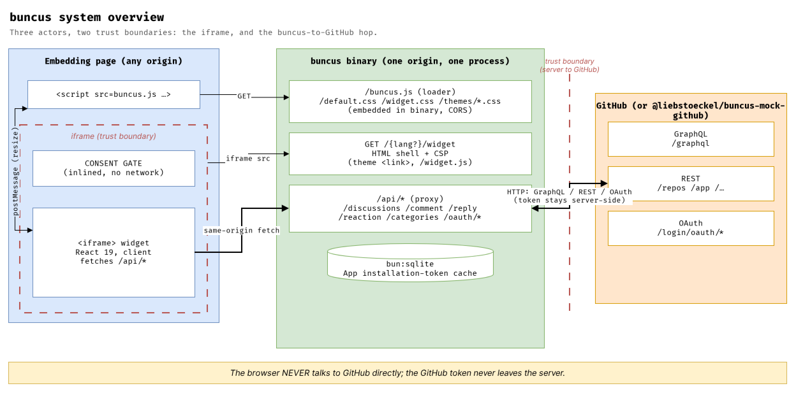

# buncus — Architecture & Design Decisions (as built)

This is the **authoritative, as-built** description of buncus: the architecture,
the data/auth flows, and every load-bearing design decision with its rationale,
the alternatives considered, and its status.

- [`SPEC.md`](./SPEC.md) is the *original pre-implementation plan*. Where it and
  this document disagree, **this document wins** (see [§9 Divergences](#9-divergences-from-the-original-spec)).
- [`packages/buncus/MIGRATION.md`](./packages/buncus/MIGRATION.md) is the giscus→buncus migration guide (a user-facing view of the deviations).
- [`packages/buncus/README.md`](./packages/buncus/README.md) is the operator/usage doc.

---

## 1. What buncus is

A **single self-contained binary** that hosts [GitHub Discussions](https://docs.github.com/discussions)
comments on third-party web pages — a Bun-native, themeable, GDPR-by-default
reimplementation of [giscus](https://giscus.app). Comments live in GitHub
Discussions; buncus is the hosting + proxy + UI layer. No Node, no `node_modules`,
no external database, no CDN at runtime.

Stack: **Bun ≥ 1.3 · React 19 · `bun:sqlite` · native `crypto.subtle` · `node:crypto`**.

---

## 2. System overview

Three actors, two trust boundaries (the iframe, and the buncus↔GitHub hop).

**Two halves over `postMessage`:** the **loader** (runs on the host page) and the
**widget** (React app inside the iframe). They communicate only via
`{ buncus: … }` messages. Everything GitHub-facing is **proxied** by the binary.

---

## 3. Components (as built)

| Area | Files | Role |
|---|---|---|
| Server entry | `src/server.ts` | `Bun.serve` router, security headers, static + widget + API dispatch |
| Config | `src/config.ts` | env parsing; memoised; `GITHUB_API_HOST`/`GITHUB_OAUTH_HOST` configurable |
| Context | `src/context.ts` | per-process singletons (token cache); session→token resolution |
| Crypto | `src/crypto/{encryption,state}.ts` | AES-GCM box + value/expiry state token |
| Cache | `src/cache/tokenCache.ts` | `bun:sqlite` installation-token cache |
| GitHub client | `src/github/{graphql,oauth,appToken,jwt,adapters}.ts` | GraphQL/REST ops, OAuth exchange + token check, App JWT, G→I adapters |
| API routes | `src/routes/api.ts` | the 8 proxied endpoints (OAuth, discussions, categories, comment, reply, reaction, webhook) |
| Widget shell | `src/routes/widget.ts` | iframe HTML doc (theme link, CSP, base target) |
| Assets | `src/routes/assets.ts` | serves embedded loader/widget/CSS/themes |
| Loader | `loader/{buncus,boot,params}.ts` | embed script: consent gate, iframe injection, postMessage relay |
| Widget app | `src/client/{widget.client.tsx,config.ts,api.ts,messages.ts,components/*}` | React 19 UI (App, Comment, CommentBox, Reactions) |
| Theming | `assets/widget.css`, `assets/themes/*.css` | `--bc-*` variable system + small theme set |
| Demo | `demo/{index.html,page.ts}`, `scripts/demo.ts` | embeddable demo page + live demo runner |
| Build | `scripts/build-assets.ts` | bundles loader (IIFE) + widget (ESM) into `dist/` |
| Mock | `packages/mock-github/**` | stateful GitHub mock for offline build/test |

---

## 4. Data & auth flows

### 4.1 Read (anonymous or signed-in)
1. Widget `GET /api/discussions?repo&term|number&…` (same-origin), optional `X-Buncus-Session`.
2. Server resolves a token: valid session → user token (decrypted); else an **App installation token** for the repo (minted via App JWT, cached in SQLite).
3. Server calls GitHub GraphQL, adapts the response (`adapters.ts`), returns flat JSON. 403/404/429 are mapped to surfaceable errors.

### 4.2 Write (comment / reply / reaction — requires sign-in)
1. Widget `POST /api/{comment,reply,reaction}` with `X-Buncus-Session`.
2. Server decrypts the session → user token, performs the GraphQL mutation **server-side**, returns the result. Widget re-fetches the thread.
3. If the discussion doesn't exist yet, the widget first `POST /api/discussions` (server validates the user via `check-token`, then **creates it as the App** with the sha1 title marker — giscus parity).

### 4.3 OAuth sign-in
1. Widget opens (top frame) `GET /api/oauth/authorize?redirect_uri=<page>`. The `redirect_uri` is validated against the `ORIGINS` allowlist (`isAllowedRedirect`) before any redirect.
2. Server encrypts the return URL into `state` (5-min TTL) → 302 to GitHub authorize.
3. GitHub → `GET /api/oauth/authorized?code&state` → server re-validates the decoded return URL, exchanges code for the **user token**, encrypts it into a **session** (TTL = `SESSION_TTL_DAYS`, default 30d), 302 back to `<page>#buncus=<session>` — in the URL **fragment**, never the query string.
4. The loader lifts `#buncus=` into `localStorage["buncus-session"]`, scrubs the URL, and passes the session into the iframe. The token itself never reaches the browser.

---

## 5. Design decisions (rationale · alternatives · status)

> Status legend: **D** = deliberate deviation from giscus · **P** = parity with giscus · **N** = new in buncus.

### D1 — Proxy ALL GitHub traffic server-side (token never in browser)
giscus hands the decrypted GitHub user token to browser JS (`/api/oauth/token`) and the browser writes directly to GitHub. **buncus keeps the token server-side**; the browser holds only the opaque encrypted *session* and calls buncus' same-origin API. **Why:** (a) the user's GitHub token is never exposed to page JS or extensions; (b) one origin, fewer moving parts for a single binary; (c) no browser↔GitHub CORS dependency. **Alternatives:** giscus' client-side model (rejected: token exposure); a BFF cookie session (rejected: cookies invite CSRF and complicate cross-site embedding). **Trade-off:** every interaction is a buncus round-trip (fine — buncus is the GitHub proxy anyway). **Status: D.** Consequence: `/api/oauth/token` is removed; new write endpoints `/api/{comment,reply,reaction}` exist.

### D2 — Single binary via `bun build --compile`, assets embedded
The loader, widget bundle, CSS, and themes are embedded with `with { type: "file" }`; the binary serves them from memory. **Why:** the entire product goal — one file to deploy. **Alternative:** ship a server + a static dir (rejected: not "single binary"). **Status: N.** Note: build order is assets → compile (`scripts/build-assets.ts` then `bun build --compile`).

### D3 — No widget SSR; static shell + client-render React
The `/widget` route returns a **static HTML shell** (theme `<link>`, `<base target="_top">`, `#buncus-root`, the bundled `/widget.js`); React mounts client-side and fetches data. **Why:** the theme link already prevents a colour flash; per-request **CSP `frame-ancestors`** is set as a response header regardless; SSR of an authenticated, data-driven widget adds machinery for little gain. **Alternative:** React SSR + hydration (as the SPEC planned) — deferred. **Trade-off:** a brief "Loading comments…" state (same as giscus). **Status: D** (vs SPEC).

### D4 — Iframe architecture; loader is a classic script, widget is ESM
The widget renders in a **cross-origin iframe** the loader injects. **Why:** style isolation from the host page, and the session in the iframe's `localStorage` is partitioned to the buncus origin (host JS can't read it). The **loader must be a classic `<script>`** (bundled IIFE) because it relies on `document.currentScript` to discover its own origin — ES modules have no `currentScript`. The **widget** is an ESM bundle. **Status: P** (giscus is also iframe-based).

### N5 — GDPR consent gate, on by default
With `data-consent="required"` (default) the loader renders an **inlined** consent placeholder and injects **no iframe and makes no network request** until the visitor opts in; choice is remembered (`localStorage["buncus-consent"]`) and revocable. Copy is en/de; `data-privacy-url` links a policy; `data-consent="skip"` restores giscus-like immediate load. **Why:** self-hosted or not, the iframe still transmits the visitor's IP to GitHub (US) → §25 TTDSG / GDPR needs prior opt-in. **Status: N.** Invariant tested in the loader-DOM and e2e tiers (no iframe pre-consent).

### D6 — Session crypto: AES-GCM box, header transport
`key = scrypt(password, per-record salt, 32)` (N=2^14, r=8, p=1) `+ 12-byte IV + AES-GCM`; wire = `32-hex-salt‖24-hex-IV‖base64(ct+tag)`. Derived keys are memoised by `(password, salt)` so the per-request decode stays O(1). The session is sent in the **`X-Buncus-Session` header**, never a cookie. **Why header, not cookie:** a header can't be sent by third-party pages → CSRF-safe by construction; cookies on a cross-site-embedded service are fragile (SameSite) and a CSRF vector. **Hardening (security-report M1):** the KDF is salted scrypt rather than giscus' unsalted single SHA-256, defeating offline brute-force of a captured session; rotating the password still invalidates all sessions. TTLs: `state` 5 min, session `SESSION_TTL_DAYS` (default 30d). **Status: P** (AES-GCM cipher) / **D** (salted-scrypt KDF, header transport, `#buncus=` fragment delivery).

### D7 — Token cache on `bun:sqlite`
Only GitHub **App installation tokens** are cached, in one SQLite table, preserving giscus' semantics: 5-minute "intolerance" window (a near-expiry token reads back blank to force a re-mint) and `created_at`-on-first-write. **Why:** giscus needs a pick-one of Supabase/PostgREST/Valkey; a single binary should have zero external services. **Alternative:** in-memory map (rejected: lost across restarts; SQLite is free and persistent). **Status: D.**

### D8 — App JWT via `node:crypto` (no `jsonwebtoken` dep)
RS256 signed with `node:crypto`'s `createSign`. **Why:** dependency-free; Bun bundles `node:crypto`. **Alternative:** `jsonwebtoken` (giscus' choice) or `crypto.subtle` RSASSA-PKCS1 (needs PKCS#8; the env PEM is PKCS#1). **Status: D.**

### N9 — Configurable GitHub hosts
`GITHUB_API_HOST` / `GITHUB_OAUTH_HOST` (default real GitHub). giscus hard-codes them. **Why:** point the whole stack at `@liebstoeckel/buncus-mock-github` to build/test **with no GitHub access**, and support GHES. **Status: N.** This is the seam the entire test strategy hangs on.

### P10 — GraphQL ops & comment rendering
GraphQL query strings are ported **verbatim** from giscus (search/number reads, categories, create, comment, reply, reaction). Comment bodies are GitHub-rendered **`bodyHTML`** rendered via `dangerouslySetInnerHTML` (buncus bundles no Markdown parser); buncus trusts GitHub's sanitised HTML. **Status: P.** (Note: the mock ships a tiny Markdown→HTML renderer so offline `bodyHTML` is plausible.)

### N11 — postMessage envelope `{ buncus: … }`
Outbound (iframe→parent): `resizeHeight`, `error`, `signOut`, `metadata` (when `emitMetadata`), `revokeConsent`. Inbound (parent→iframe): `setConfig` (incl. `theme`). **Why:** namespace independence from giscus. **Status: D** (giscus uses `{ giscus: … }`). Embed `data-*` attributes stay giscus-compatible for drop-in swap.

### D12 — Theming: `--bc-*` variables, small built-in set + custom URL
A theme is a CSS file setting `--bc-*` variables; `widget.css` is theme-agnostic. Built-ins: `light`, `dark`, `preferred_color_scheme` (media-query based); any `https://…`/`/path` CSS URL is loaded as a custom theme; runtime swap via `setConfig.theme`. **Why:** "small default theme" goal; custom URL covers the long tail without shipping 24 Primer themes. **Status: D** (giscus ships 24 themes with `--color-*` Primer vars).

### D13 — CORS & origin gating
**Assets** (`/buncus.js`, CSS, themes) send `Access-Control-Allow-Origin: *` because the embed `<script crossorigin>` loads them cross-origin (this was a real bug the e2e caught). The **API** is served same-origin to the iframe and the header transport keeps it CSRF-safe; on top of that, `/api/*` now **enforces the `ORIGINS` allowlist** on the `Origin` header (403 + reflected ACAO/`Vary` for disallowed browser origins — security-report M6). **Framing** is gated by CSP `frame-ancestors`, computed from the `ORIGINS` env (empty = **same-origin only**; `frame-ancestors` fails closed to `'none'` for absent/malformed/unmatched origins). **Why ORIGINS env, not giscus.json:** single-tenant self-host; no per-repo file fetch. **Status: D.**

### N14 — `@liebstoeckel/buncus-mock-github` as a first-class subpackage
A stateful, dependency-free Bun mock of GitHub's OAuth/REST/GraphQL surfaces, grounded in GitHub's OpenAPI/docs + giscus' actual consumption (see its `SCHEMAS.md`). In-process `fetch(req)` for unit tests, `.listen(port)` for the binary/e2e. **Why:** the task must build/test with no GitHub access. **Status: N.**

### Security model (summary of the above)
- **Token isolation** (D1, D4): GitHub token server-side only; session partitioned to the iframe origin.
- **CSRF-safe** (D6): session in a header, not a cookie.
- **Framing control** (D13): per-request CSP `frame-ancestors`.
- **XSS posture** (P10): renders GitHub-sanitised `bodyHTML`; buncus adds no unsanitised HTML. (Hardening TODO: a DOMPurify pass on `bodyHTML` like giscus, see §8.)
- **Security headers** (server.ts): `nosniff`, `Referrer-Policy: strict-origin`, `Permissions-Policy`.

### Security hardening (from the security review)
An internal security review was conducted; **all findings are remediated** (regression-tested in `test/security.test.ts`). Load-bearing additions:
- **OAuth redirect allowlist** (`isAllowedRedirect`) + session delivered in the URL **fragment** (`#buncus=`), not the query — no open-redirect token leak (C1).
- **Secret hardening**: production refuses to boot on missing/known-dev/short secrets; mock defaults gated behind `BUNCUS_MOCK=1` (H1).
- **Salted scrypt KDF** with per-record salt + memoised keys (M1); **installation tokens encrypted at rest** + DB chmod 0600 (M2).
- **Widget CSP** (`default-src 'none'`, `script-src 'self'`, scoped `style-src`) + theme-origin allowlist (`THEME_ORIGINS`) + origin-checked runtime theme swap (M3/M4).
- **`repo` validation** + per-IP **rate limiting** on `/api/*` (M5); **API origin enforcement** against the `ORIGINS` allowlist, and `frame-ancestors` that fails closed (M6).
- Configurable session TTL (`SESSION_TTL_DAYS`, default 30d), webhook HMAC verification, scheme-validated author links, and metadata never broadcast to `*`.

**Deployment consequence:** cross-origin embedding now **requires `ORIGINS`** (empty = same-origin only).

---

## 6. Build & packaging

`bun run build:assets` → bundles `loader/buncus.ts` to `dist/buncus.js` (IIFE, minified) and `src/client/widget.client.tsx` to `dist/widget.js` (ESM, React bundled). `bun run compile` → `build:assets` then `bun build --compile --outfile dist/buncus src/server.ts`, embedding the built JS + CSS/themes via `with { type: "file" }`. Result: `dist/buncus` (~91 MB incl. the Bun runtime). Runtime needs: the binary, a writable path for `BUNCUS_DB`, and env vars.

---

## 7. Testing strategy

All tiers run against `@liebstoeckel/buncus-mock-github` — **no GitHub needed**. 82 tests / 12 files.

- **unit** — crypto (round-trip, TTL, tamper), `bun:sqlite` cache (intolerance, created_at), loader params/mapping/consent.
- **integration** — proxied API + server routes vs the in-process mock (OAuth dance; create→comment→reply→react→read-back; anonymous app-token path; 404/403).
- **render** — widget React components via `react-dom/server`.
- **loader DOM** — consent gate → iframe injection under happy-dom.
- **e2e** — Playwright + real headless Chromium: demo page → gate → iframe → seeded discussion → OAuth sign-in → post a comment → theme. **Decision:** `bun test` + the `playwright` library (not `@playwright/test`) to fold into the Bun tier; `channel: "chromium"` (full build — the `chrome-headless-shell` SIGSEGVs in some sandboxes). Skips cleanly if no browser is installed.
- **binary smoke** — `scripts/smoke.ts` exercises the compiled binary over HTTP.

---

## 8. Known limitations / not yet implemented

Honest scope boundaries (the goal allowed scoping the clone):

- **Upvotes**: the GraphQL op exists in giscus' surface but the UI doesn't expose upvoting (GitHub disallows app-issued user tokens upvoting).
- **No "load more" pagination in the UI**: the widget fetches the first N (default 50) comments; the front/back dual-pagination giscus does isn't implemented (the read API and cursors support it).
- **No math rendering** (giscus' MathJax `<math-renderer>`) and **no client-side DOMPurify** pass on `bodyHTML` — a hardening TODO; currently relies on GitHub's server-side sanitisation.
- **Themes**: 3 built-ins + custom URL (not giscus' 24).
- **GitHub-side rate-limit (429) simulation** isn't in the mock (the relay code path + mapping exist). buncus' *own* per-IP rate limiting is implemented and tested.
- **Session revocation** isn't implemented (TTL shortened to 30d as interim mitigation).
- **Real GitHub**: needs a registered GitHub App (see MIGRATION §Step 1); only mock-verified so far.

---

## 9. Divergences from the original SPEC

`SPEC.md` was written before implementation. As-built differences:

| SPEC planned | As built | Decision |
|---|---|---|
| React 19 **SSR** + hydration, SWR data layer | static shell + **client-render**, no SWR (plain hooks, refetch-after-write) | D3 |
| Token handed to browser per giscus; writes browser→GitHub | **all GitHub traffic proxied**; token server-side | D1 |
| 24 themes ported, Tailwind v4 widget CSS | **3 themes**, hand-written `--bc-*` CSS | D12 |
| `giscus`-compat postMessage flag | `buncus` namespace only | N11 |
| Origin gating via per-repo `giscus.json` | `ORIGINS` env → CSP | D13 |
| Layout `src/`, `loader/`, `assets/` at repo root | same, but under `packages/buncus/` (Bun workspace) | layout |

The SPEC remains useful as the design narrative and the full giscus reverse-engineering reference; this document is the source of truth for what exists.
